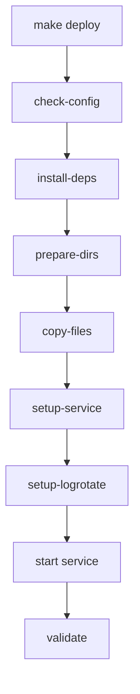

# 📁 Estrutura do Projeto

## Visão Geral
```
jellyfin-organizer/
├── src/                    # Código fonte principal
├── scripts/               # Scripts de sistema e utilitários
├── config/                # Arquivos de configuração
├── docs/                  # Documentação
├── tests/                 # Testes e exemplos
├── tools/                 # Ferramentas de instalação
├── Makefile              # Automação de deploy
├── README.md             # Documentação principal
└── requirements.txt      # Dependências Python
```

## Detalhamento dos Diretórios

### `/src/` - Código Fonte
```
src/
├── __init__.py           # Módulo principal
├── auto_organize_anime.py # Motor de organização
├── monitor_downloads.py   # Monitor em tempo real
└── config.py             # Configurações centralizadas
```

### `/scripts/` - Scripts de Sistema
```
scripts/
├── organize-anime.sh         # Interface CLI
└── qbittorrent-completion.sh # Hook do qBittorrent
```

### `/config/` - Configurações
```
config/
├── default.conf          # Configurações padrão
├── anime-organizer.service # Serviço SystemD
└── qbittorrent_config.py  # Config específica do qBittorrent
```

### `/docs/` - Documentação
```
docs/
├── CHANGELOG.md          # Histórico de mudanças
├── DEPLOYMENT_SUMMARY.md # Resumo do deploy
└── README_Sistema_Anime.md # Documentação técnica
```

### `/tests/` - Testes
```
tests/
├── teste_temporadas.py   # Testes de reconhecimento
└── example_usage.py      # Exemplos de uso
```

### `/tools/` - Ferramentas
```
tools/
└── install.sh           # Instalador legacy
```

## Arquivos na Raiz

### `Makefile`
Sistema de build e deploy automatizado:
- `make deploy` - Instalação completa
- `make start/stop/restart` - Controle do serviço
- `make test` - Executar testes
- `make uninstall` - Desinstalar sistema

### `pyproject.toml`
Configuração do projeto Python com:
- Metadados do projeto
- Dependências
- Configurações de ferramentas (black, isort, etc.)

### `requirements.txt`
Lista de dependências Python necessárias

## Fluxo de Instalação



## Localização no Sistema

### Após Instalação
```
/opt/anime-organizer/       # Código instalado
├── auto_organize_anime.py
├── monitor_downloads.py
├── config.py
├── organize-anime.sh
├── qbittorrent-completion.sh
└── default.conf

/usr/local/bin/             # Comandos CLI
└── organize-anime          # Symlink para script

/etc/systemd/system/        # Serviço
└── anime-organizer.service

/var/log/                   # Logs
└── anime-organizer.log
```

## Vantagens da Nova Estrutura

### 🎯 Organização
- **Separação clara** entre código, configuração e documentação
- **Facilita manutenção** e localização de arquivos
- **Padrão profissional** seguindo convenções Python

### 🚀 Deploy Automatizado
- **Makefile completo** com todos os comandos necessários
- **Validação automática** de configuração
- **Instalação em uma linha** com `make deploy`

### 🔧 Facilidade de Desenvolvimento
- **Ambiente isolado** com dependências claras
- **Testes organizados** em diretório próprio
- **Documentação centralizada** e acessível

### 📦 Distribuição
- **pyproject.toml** para empacotamento Python
- **requirements.txt** para dependências
- **Estrutura compatível** com pip/PyPI

## Comandos Úteis

### Desenvolvimento
```bash
make dev-setup     # Configurar ambiente
make test          # Executar testes
make clean         # Limpar temporários
```

### Produção
```bash
make deploy        # Instalar e iniciar
make status        # Ver status
make logs          # Monitorar logs
make health        # Verificar saúde
```

### Manutenção
```bash
make backup        # Fazer backup
make update        # Atualizar código
make validate      # Validar instalação
make uninstall     # Desinstalar
```

Esta estrutura proporciona um projeto mais profissional, fácil de manter e com deploy automatizado!